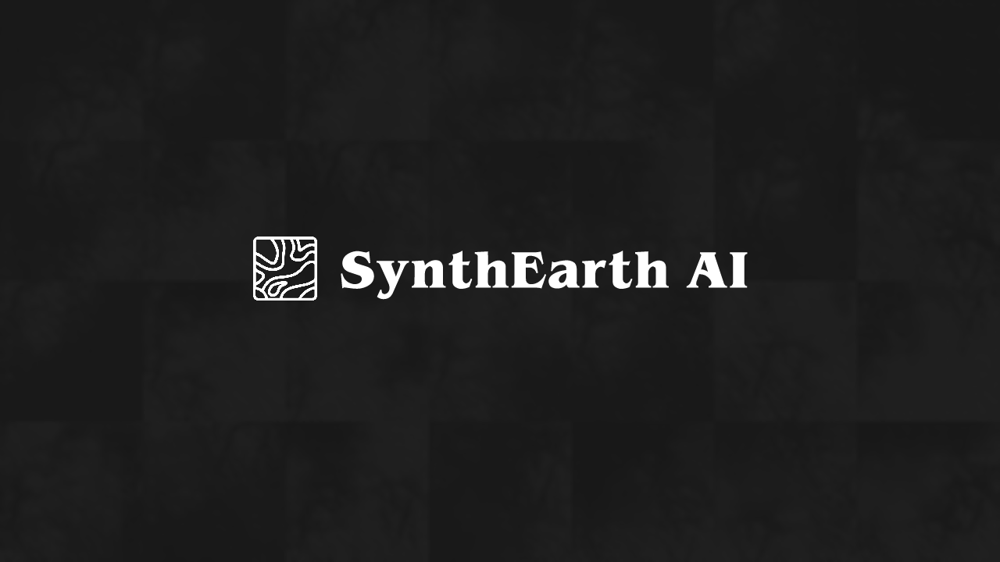
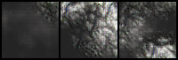

# SynthEarth Dataset
Welcome to the official GitHub repository for The SynthEarth dataset, a comprehensive and high-quality dataset specifically created for [Realistic Terrain Generation Using Generative Adversarial Networks]() and utilized in [SynthEarth AI](https://mayonaka88.itch.io/synthearth-ai). This Readme file serves as a guide to understanding the dataset, its features, and future plans. 

### Please note that The SynthEarth dataset is a closed-source dataset available for sale, ensuring its exclusivity and value to potential customers.

## Overview

The SynthEarth dataset is a brand-new dataset created specifically for [Realistic Terrain Generation Using Generative Adversarial Networks]() and utilized in [SynthEarth AI](https://mayonaka88.itch.io/synthearth-ai). The dataset is created based on real-world terrain elevation data.

The new dataset was created by training a DCGAN on real-world terrain elevation data and utilizing it to create brand new unique hyper-realistic images of real word elevation. Each image in the new SynthEarth dataset is normalized, changed to greyscale, and has the dimensions of 64 pixels by 64 pixels.

Currently, The SynthEarth dataset consists of 150k unsegmented images, 150k 2 shades segmented images, 150k 3 shades segmented images, and 150k 5 shades segmented images. In total, there are currently 600k images in the dataset with plans for expansion.

> A small subset has been provided in this repository

### Unsegmented
 

### 2 Shades Segmentation
 

### 3 Shades Segmentation
 

### 5 Shades Segmentation
 

In the future, The SynthEarth dataset is planned to exceed over 3 million segmented and unsegmented images with dimensions larger than 64x64 pixels.

As a closed-source dataset, The SynthEarth Dataset is available for sale, and access to it requires a valid licensing agreement. This approach ensures that the dataset's exclusivity is maintained, and its value is preserved for businesses seeking a competitive advantage or advanced analytics capabilities.

To inquire about licensing options and pricing, please reach out to me via [email](abdallah.elabora@gmail.com) or [LinkedIn](https://www.linkedin.com/in/abdallah-elabora-0942a6233/).

 
